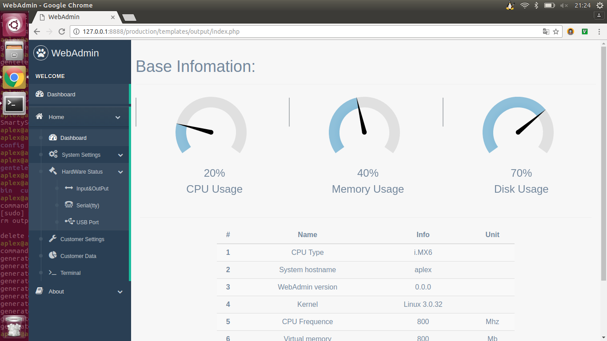

# EnWebAdmin

* 参考[gentelella](https://github.com/puikinsh/gentelella)做的模板；
* 这是一个PHP网站模板系统，采用Smarty进行模板解析;
* bin/emWebAdmin用于将custom、dependents、templates中的内容拷贝到对应的地方，生成contents中对应的内容，源代码很简单;
* templates/gentelella/base.tpl是一个很重要得模板文件，被bin/emWebAdmin用于生成对应的文件:

```
    sed "s/\*\*\*\*\*\*\*\*/$content/g" templates/gentelella/base.tpl > output/`basename $content .tpl`.php
```
* custom/common/config/setup.json用于系统配置，custom/common/config.php用于解读，并将数据放入Smarty中:

```
    <?php
        $cfgs = json_decode(file_get_contents("config/setup.json"), true);
        // echo $configures['name'];
        $smarty->assign('cfgs', $cfgs);
    ?>
```

# 效果图


# 配置文件说明

> 待续

# 目录说明

```
.
├── custom
│   ├── common                      # 一些不能被合成的php文件，自定义的css、js文件
│   │   ├── config                  # json配置文件目录
│   │   ├── config.php              # PHP接写json配置文件，并保存在Smarty变量中
│   │   ├── css                     # 自定义的css样式
│   │   ├── js                      # 自定义的js样式
│   │   ├── loginDealWith.php       # 处理登如验证
│   │   └── login.php               # 登录界面
│   └── contents                    # 可以被合成的php文件，只需要专注于写内容就OK，完全支持bootstrap。
│       ├── about.php
│       ├── customerData.php
│       ├── customerSettings.php
│       ├── dataAndCalander.php
│       ├── hardware.php
│       ├── index.php
│       ├── network.php
│       ├── plain_page.php
│       └── update.php
├── LICENSE
├── Makefile                        # make依赖的Makefile文件，会调用bin/emWebAdmin文件执行相关操作
├── output                          # bin/emWebAdmin执行的输出目录
├── README.md
└── templates                       # 本websit依赖gentelella UI框架，并使用smarty作为template解析库
    ├── bin
    │   └── emWebAdmin              # 会被Makefile调用的可执行文件，会自动处理文件合成、拷贝等县官相关事务
    ├── dependents                  # gentelella通用的依赖的js、css库
    │   ├── css
    │   ├── fonts
    │   ├── images
    │   ├── js
    │   ├── smarty
    │   └── useful
    ├── gentelella
    │   ├── base.tpl                # 很重要的基板
    │   ├── foot.tpl
    │   ├── head.tpl
    │   ├── nav.tpl
    │   └── tail.tpl
    └── smarty
        ├── config                  # template模板
        └── preprocess              # template预处理，session处理也在内

39 directories, 157 files
```
